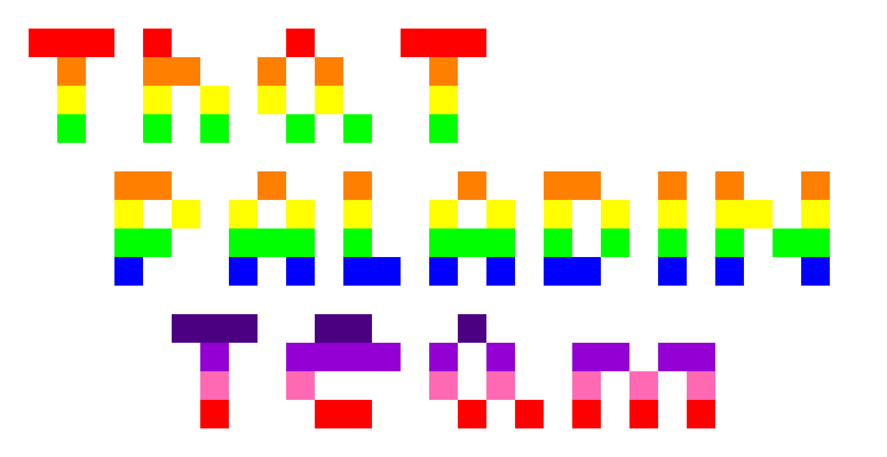

# pyllustrate
Text-based command-line image creation for quick pixel-art via python.

## Background
I've always loved using applications such as asesprite for quick pixel-art while working on various projects. However, after the jump to Ubuntu I have grown tired of switching back to Mac OS to make a simple sprite. Pyllustrate hopes to solve this issue.

## Dependencies
* Works with ```Python 3.6```
* For conversions to png and jpg, ```ImageMagick``` is required for Linux and the ```PIL``` library is required for Python

## Example
Navigate to the pyllustrate folder and type ```python3.6 pyllustrate.py paladin.txt paladinimage -m 100 -t png -r``` to convert paladin.txt into a ppm and png. This will convert:
```
paladin.txt
use rainbow
{
0000000000000000000000000000000
0111010000100011100000000000000
0020022002020002000000000000000
0030030303030003000000000000000
0040040400404004000000000000000
0000000000000000000000000000000
0000220002002000200220020200200
0000303030303003030303030330300
0000440044404004440404040404400
0000500050505505050550050500500
0000000000000000000000000000000
0000006660066000600000000000000
0000000700777707070077077000000
0000000800800008080080808000000
0000000100011000101010101000000
0000000000000000000000000000000
}
```
into:


## Flags and usage
* ```-m x``` or ```-magnify x``` will create the image at x times magnification. The ppm created from the image is P3 style, and therefore takes up a large amount of space. Be careful when using magnify as you may get an image much larger than you desired. For this reason, magnify is cut off at 1000, but should probably not be used at over 100. The following two commands are useful if a larger file is needed.
* ```-t x``` or ```-type x``` will convert the image to png (if x is png) or jpg (if x is jpg) as long as the dependencies are installed.
* ```-r``` or ```-remove``` will remove the ppm image if the image is converted to png or jpg.
* ```-c x y``` or ```-change x y``` will morph character x in the image text file into character y in the image text file permanently before compiling the image.

## Current Issues and Development
As of now there are only 2 palettes, however any user can add more by following the format inside. All characters can work in the image if specified in the pixel's plain-text file. More examples and palettes will be added as the tools in the program are expanded to fit my needs. 
